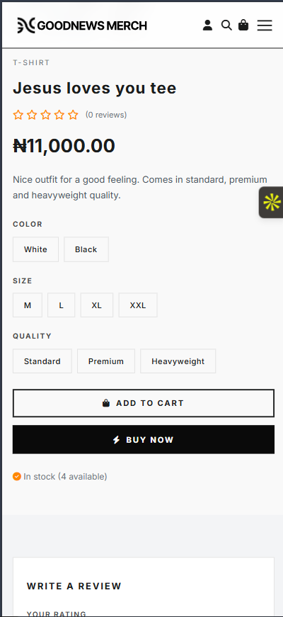
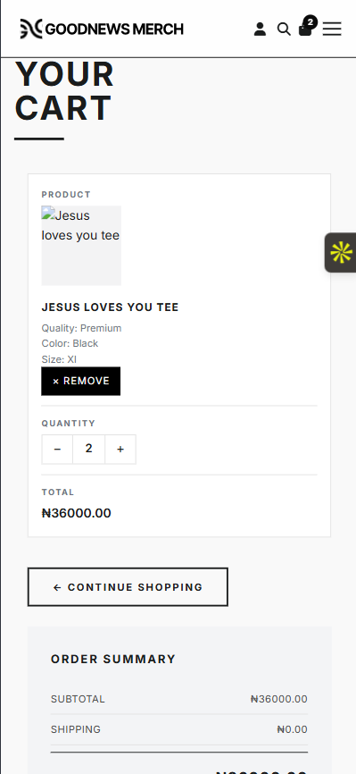
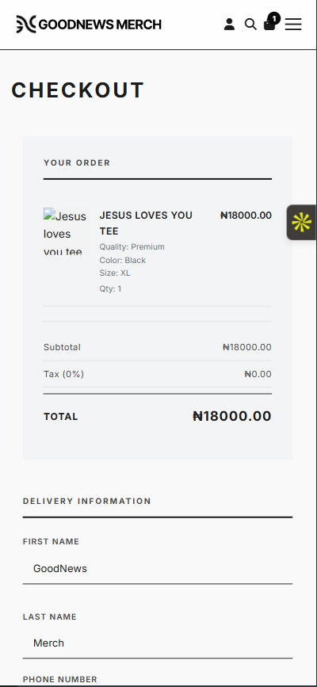

# GoodNews Merch

A faith-inspired e-commerce platform built with Django for selling apparel and Christian merchandise.

## Overview

GoodNews Merch is a full-stack online store with product listings, product variations, cart logic, checkout flow, order handling, and admin management.

## Features

- Product catalogue
- Product categories
- Size, colour, and quality variations
- Cart system for guests and logged-in users
- Checkout flow
- Order management
- Static and media file handling
- Production deployment

## Tech Stack

- Python
- Django
- SQLite/PostgreSQL
- HTML
- CSS
- JavaScript
- Railway
- WhiteNoise

## Screenshots

### Homepage


### Product Page


### Cart Page


### Checkout


## Setup

```bash
git clone https://github.com/succinct-cyber/GoodNewsMerch.git
cd GoodNewsMerch
python -m venv venv
venv\Scripts\activate
pip install -r requirements.txt
python manage.py migrate
python manage.py runserver
